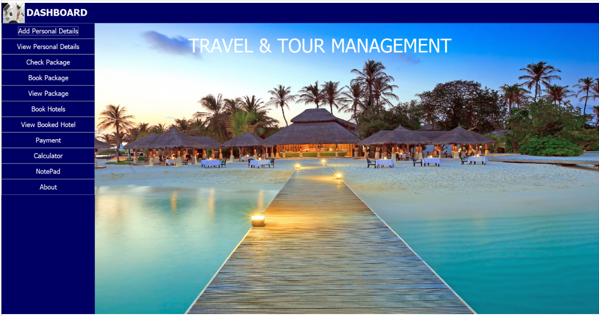
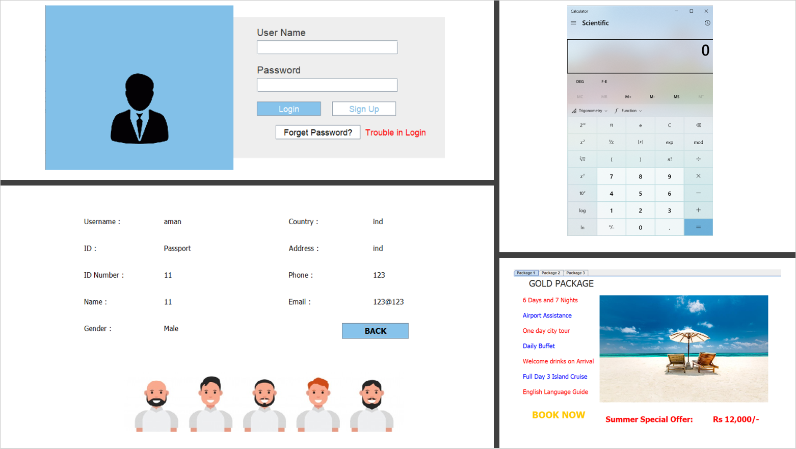
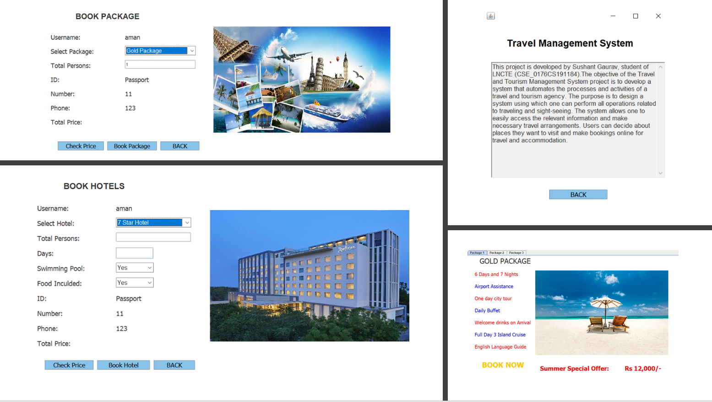

# Travel Planner

> Lets choose the best deal to the destination that give you the best feel!

---

## Table of Contents

  - [Description](#description)
  - [References](#references)
  - [Outputs](#outputs)
  - [License](#license)
  - [Author Info](#author-info)

---

## Description

The objective of the Travel and Tourism Management System Project is to develop a system that automates the processes and activities of a travel and tourism agency. The purpose is to design a system using which one can perform all operations related to traveling and sight-seeing. The system allows one to easily access the relevant information and make necessary travel arrangements. Users can decide about places they want to visit and make bookings online for travel and accommodation. 
Java Swing along with AWT is used to give the smooth interface of the webpage.  
**MySQL Java Connector** is also used to connect our front-end to the database.

### Some of the features of this Web-Application:

- Add personal details tab.
- About tab.
- Forget Password tab.
- New User Login.
- Hotel Details tab.
- Hotel Booking tab.
- Open different systems applications like: Calculator, notepad etc.
- Payment tab (PAYTM)
- Vacation Package Details tab.
- Vacation Package booking tab.
- View booked hotel tab.
- View booked package tab.
- View personal details tab.

### Languages and Technologies:

- Backend:
  - Core Java
- Frontend:
  - Java Swing
  - AWT
- DataBase:
  - MySQL
- IDE Used:
  - NetBeans(8.0) [you can also use any of your preferred one.]

[Back To The Top](#travel-planner)

---

## References

UI of the webapp resembles general ticket or hotel booking webpage like oyo-rooms or goibibo etc.  
The images are taken from free image providing websites like unsplash and pexels.

[Back To The Top](#travel-planner)

---

## Outputs
 
 

[Back To The Top](#travel-planner)

---
## License

#### MIT License

Copyright (c) 2021 Sushant Gaurav

Permission is hereby granted, free of charge, to any person obtaining a copy
of this software and associated documentation files (the "Software"), to deal
in the Software without restriction, including without limitation the rights
to use, copy, modify, merge, publish, distribute, sublicense, and/or sell
copies of the Software, and to permit persons to whom the Software is
furnished to do so, subject to the following conditions:

The above copyright notice and this permission notice shall be included in all
copies or substantial portions of the Software.

THE SOFTWARE IS PROVIDED "AS IS", WITHOUT WARRANTY OF ANY KIND, EXPRESS OR
IMPLIED, INCLUDING BUT NOT LIMITED TO THE WARRANTIES OF MERCHANTABILITY,
FITNESS FOR A PARTICULAR PURPOSE AND NONINFRINGEMENT. IN NO EVENT SHALL THE
AUTHORS OR COPYRIGHT HOLDERS BE LIABLE FOR ANY CLAIM, DAMAGES OR OTHER
LIABILITY, WHETHER IN AN ACTION OF CONTRACT, TORT OR OTHERWISE, ARISING FROM,
OUT OF OR IN CONNECTION WITH THE SOFTWARE OR THE USE OR OTHER DEALINGS IN THE
SOFTWARE.

[Back To The Top](#travel-planner)

---

## Author Info

- Twitter - [@imsushant12](https://twitter.com/_im_sushant)
- Website - [My Portfolio](https://imsushant.github.io)

[Back To The Top](#travel-planner)

